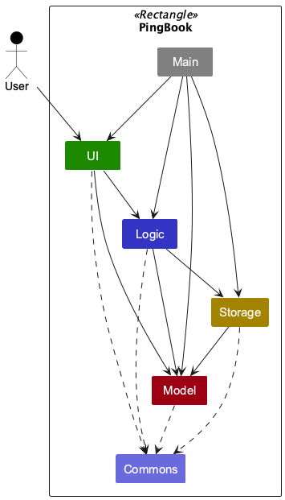
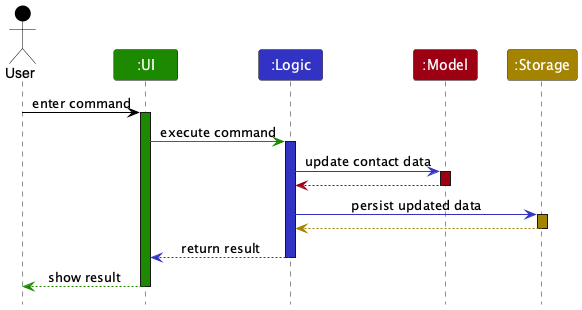
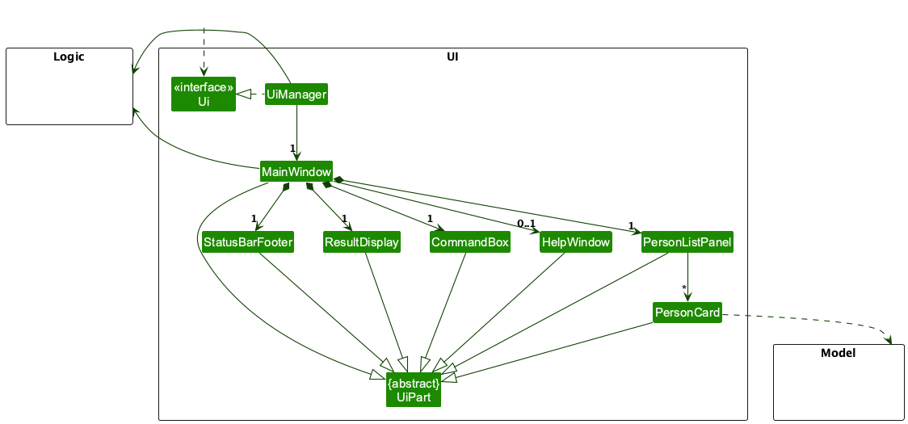
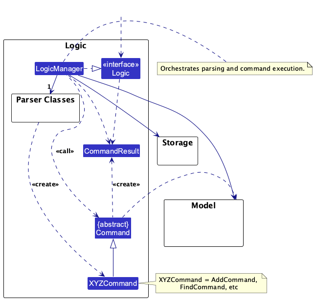
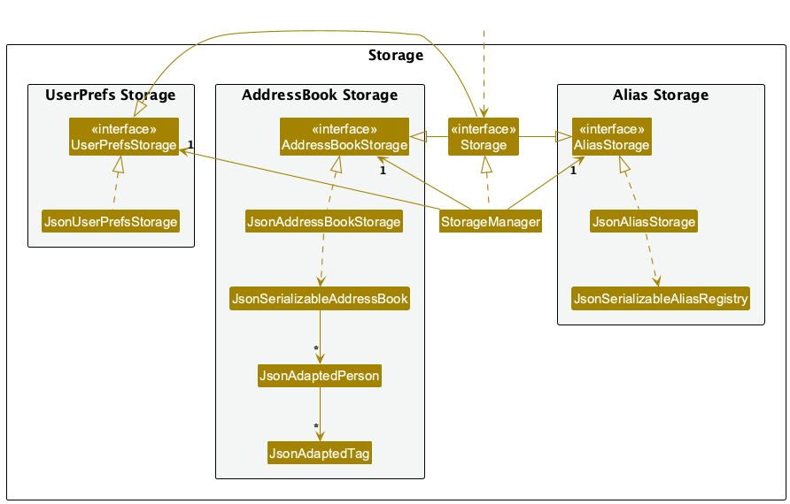

* Table of Contents
{:toc}

---

## **Acknowledgements**

- This project is based on the [AddressBook-Level3 (AB3)](https://se-education.org/addressbook-level3/) project created by [SE-EDU](https://github.com/se-edu). The code architecture, documentation structure, and test infrastructure originate from AB3.
- The JavaFX UI toolkit is used for the GUI ([OpenJFX](https://openjfx.io/)).
- JSON persistence uses [Jackson](https://github.com/FasterXML/jackson).

---

## **Setting up, getting started**

Refer to the guide [_Setting up and getting started_](SettingUp.md).

---

## **Design**

:bulb: **Tip:** The `.puml` files used to create diagrams are in this document `docs/diagrams` folder. Refer to the [_PlantUML Tutorial_ at se-edu/guides](https://se-education.org/guides/tutorials/plantUml.html) to learn how to create and edit diagrams.

### Architecture

The diagram above shows PingBook at the component level. It deliberately omits lower-level classes and methods so that the main design decisions are easier to see.

PingBook is organised around five coarse-grained components:

- **`Main`** starts the application, wires the components together, and handles shutdown.
- [**`UI`**](#ui-component) accepts user input and renders results.
- [**`Logic`**](#logic-component) parses commands and coordinates command execution.
- [**`Model`**](#model-component) stores in-memory contact data and filtered views.
- [**`Storage`**](#storage-component) persists application data to disk.

[**`Commons`**](#common-classes) contains utility classes shared by multiple components.

The sequence diagram below shows the same architecture for a typical write operation such as `delete 1`.

At this level, the important flow is:

1. The user enters a command through the `UI` component.
2. `UI` passes the command to `Logic`.
3. `Logic` updates `Model` and asks `Storage` to persist the updated state.
4. `Logic` returns the outcome to `UI`, which displays it to the user.

The sections below give more details of each component.

### UI component

The **API** of this component is specified in [`Ui.java`](https://github.com/AY2526S2-CS2103T-T17-2/tp/tree/master/src/main/java/seedu/address/ui/Ui.java)

The UI consists of a `MainWindow` that is made up of parts e.g.`CommandBox`, `ResultDisplay`, `PersonListPanel`, `StatusBarFooter` etc. All these, including the `MainWindow`, inherit from the abstract `UiPart` class which captures the commonalities between classes that represent parts of the visible GUI.

The `UI` component uses the JavaFx UI framework. The layout of these UI parts are defined in matching `.fxml` files that are in the `src/main/resources/view` folder. For example, the layout of the [`MainWindow`](https://github.com/AY2526S2-CS2103T-T17-2/tp/tree/master/src/main/java/seedu/address/ui/MainWindow.java) is specified in [`MainWindow.fxml`](https://github.com/AY2526S2-CS2103T-T17-2/tp/tree/master/src/main/resources/view/MainWindow.fxml)

The `UI` component,

- executes user commands using the `Logic` component.
- listens for changes to `Model` data so that the UI can be updated with the modified data.
- keeps a reference to the `Logic` component, because the `UI` relies on the `Logic` to execute commands.
- depends on some classes in the `Model` component, as it displays `Person` object residing in the `Model`.

### Logic component

**API** : [`Logic.java`](https://github.com/AY2526S2-CS2103T-T17-2/tp/tree/master/src/main/java/seedu/address/logic/Logic.java)

Here's a (partial) class diagram of the `Logic` component:

The sequence diagram below illustrates the interactions within the `Logic` component, taking `execute("delete 1")` API call as an example.

:information_source: **Note:** The lifeline for `DeleteCommandParser` should end at the destroy marker (X) but due to a limitation of PlantUML, the lifeline continues till the end of diagram.

How the `Logic` component works:

1. When `Logic` is called upon to execute a command, it is passed to an `AddressBookParser` object which in turn creates a parser that matches the command (e.g., `DeleteCommandParser`) and uses it to parse the command.
1. This results in a `Command` object (more precisely, an object of one of its subclasses e.g., `DeleteCommand`) which is executed by the `LogicManager`.
1. The command can communicate with the `Model` when it is executed (e.g. to delete a person). 
   Note that although this is shown as a single step in the diagram above (for simplicity), in the code it can take several interactions (between the command object and the `Model`) to achieve.
1. The result of the command execution is encapsulated as a `CommandResult` object which is returned back from `Logic`.

Here are the other classes in `Logic` (omitted from the class diagram above) that are used for parsing a user command:

How the parsing works:

- When called upon to parse a user command, the `AddressBookParser` class creates an `XYZCommandParser` (`XYZ` is a placeholder for the specific command name e.g., `AddCommandParser`) which uses the other classes shown above to parse the user command and create a `XYZCommand` object (e.g., `AddCommand`) which the `AddressBookParser` returns back as a `Command` object.
- All `XYZCommandParser` classes (e.g., `AddCommandParser`, `DeleteCommandParser`, ...) inherit from the `Parser` interface so that they can be treated similarly where possible e.g, during testing.
- `AddressBookParser` resolves user-defined aliases before dispatching to the built-in command switch, so aliases and built-in command words share the same downstream parser and validation logic.
- For commands that should not accept trailing arguments (`list`, `listarchived`, `help`, `exit`, and `sort`), `AddressBookParser` performs a direct no-extra-arguments check before constructing the command. This prevents mistyped inputs such as `list archived` from being silently treated as `list`.

### Model component

**API** : [`Model.java`](https://github.com/AY2526S2-CS2103T-T17-2/tp/tree/master/src/main/java/seedu/address/model/Model.java)

The `Model` component,

- stores the address book data i.e., all `Person` objects (which are contained in a `UniquePersonList` object).
- stores the currently 'selected' `Person` objects (e.g., results of a search query) as a separate _filtered_ list which is exposed to outsiders as an unmodifiable `ObservableList<Person>` that can be 'observed' e.g. the UI can be bound to this list so that the UI automatically updates when the data in the list change.
- stores a `UserPref` object that represents the user’s preferences. This is exposed to the outside as a `ReadOnlyUserPref` objects.
- does not depend on any of the other three components (as the `Model` represents data entities of the domain, they should make sense on their own without depending on other components)

### Storage component

**API** : [`Storage.java`](https://github.com/AY2526S2-CS2103T-T17-2/tp/tree/master/src/main/java/seedu/address/storage/Storage.java)

The `Storage` component,

- can save both address book data and user preference data in JSON format, and read them back into corresponding objects.
- inherits from `AddressBookStorage`, `UserPrefsStorage`, and `AliasStorage`, so it can be treated as any one of those interfaces where only that capability is needed.
- depends on some classes in the `Model` component (because the `Storage` component's job is to save/retrieve objects that belong to the `Model`)
- uses `JsonPingBookStorage` as a shared implementation of both `AddressBookStorage` and `AliasStorage`, so contacts and aliases are persisted together in the same `data/pingbook.json` file.
- attempts to recover from a malformed primary `pingbook.json` by reading the adjacent `.bak` backup file first, if one exists.

### Common classes

Classes used by multiple components are in the `seedu.address.commons` package.

---

## **Implementation**

This section describes some noteworthy details on how certain features are implemented.

### Starred contacts feature

The starred contacts feature adds a `starred` boolean state to `Person`, with the following behavior:

1. `star INDEX` marks the person at the displayed index as starred.
2. `unstar INDEX` removes the starred state from the person at the displayed index.
3. Repeating `star` on an already-starred person (or `unstar` on an already-unstarred person) is handled as an informative no-op.

### Argument tokenization invariant

- `ArgumentTokenizer` extracts argument values using the start positions of detected prefixes in the input string.
- Before extraction, all detected prefix positions are sorted by start index to ensure deterministic traversal order.
- A non-decreasing-order invariant is checked via `isNonDecreasingPositions(...)` before extraction begins.
- The invariant check is performed once up front instead of repeating checks inside the extraction loop.
- This is an internal sanity guard for parser correctness and does not change user-facing command behavior.

#### Model and ordering

- `Person` stores `starred` as a data field (default `false`).
- `Person#isSamePerson` is unchanged (identity remains name-based).
- Full object equality/hash semantics include `starred`.
- `AddressBook` enforces starred-first ordering after person-list mutations.
- Within the starred and unstarred groups, relative order is preserved.

#### Storage

- `JsonAdaptedPerson` persists the `starred` field.
- Backward compatibility is preserved by treating missing `starred` values in legacy JSON files as `false`.

#### UI

- `PersonCard` renders a subtle star marker for starred contacts.
- The marker is hidden for unstarred contacts to keep the layout compact.

### Data archiving

#### Implementation

The data archiving feature is implemented with an `isArchived` flag in `Person`.

- `archive INDEX` marks a contact as archived.
- `unarchive INDEX` restores an archived contact to active status.
- `list` shows only active contacts.
- `listarchived` shows only archived contacts.

The archive status is persisted in JSON storage through `JsonAdaptedPerson` using an `archived` property.
To preserve backward compatibility with existing save files, missing `archived` values are treated as `false`.

#### Command flow

1. `AddressBookParser` routes `archive` and `unarchive` to their dedicated parsers.
2. The parsers parse a one-based index using `ParserUtil.parseIndex`.
3. The command resolves the target `Person` from `Model#getFilteredPersonList`.
4. The command creates a new `Person` copy with the same fields except updated `isArchived`.
5. `Model#setPerson` replaces the target person and refreshes the filtered list.

#### Filtering behavior

The app defaults to showing active contacts only.

- `Model.PREDICATE_SHOW_ACTIVE_PERSONS` is used by default list views.
- `find` and `filter` apply their predicates together with the active predicate.
- `listarchived` uses `Person::isArchived` to show archived entries explicitly.

#### Design considerations

- Alternative considered: physically moving archived contacts into a separate list.
    - Rejected because it would complicate storage and command behavior.
- Current approach: keep a single person list with an archive flag.
    - Simpler migration path and minimal changes to existing command architecture.

#### Tests

Coverage includes:

- `ArchiveCommandTest` and `UnarchiveCommandTest` for command behavior.
- `ArchiveCommandParserTest` and `UnarchiveCommandParserTest` for parser validation.
- `AddressBookParserTest` routing coverage for `archive`, `unarchive`, and `listarchived`.
- `JsonAdaptedPersonTest` for archive persistence and backward compatibility defaults.
- `ModelManagerTest` and `PersonTest` regression checks for archive filtering and object semantics.

### Remark feature

The `remark` command sets or clears a free-text note on a contact.

- `remark INDEX r/REMARK_TEXT` sets the remark on the person at the displayed index.
- `remark INDEX r/` clears the existing remark (empty `r/` value).
- `remark` accepts only one `r/` prefix; repeated `r/` prefixes are rejected as invalid input.

#### Command flow

1. `RemarkCommandParser` parses the one-based index and the `r/` prefix value from the user input.
    It also validates that `r/` appears at most once.
2. `RemarkCommand` resolves the target `Person` from `Model#getFilteredPersonList`.
3. It creates a new `Person` copy via `Person#withRemark(Remark)`, with all other fields unchanged.
4. `Model#setPerson` replaces the original with the updated copy.
5. The filtered list is reset to active contacts after the edit.

#### Model

- `Remark` is an immutable value class wrapping a single `value` string; an empty string represents no remark.
- `Person#withRemark(Remark)` returns a new `Person` instance to preserve full object immutability.
- `JsonAdaptedPerson` persists the `remark` field. Missing values in older data files default to an empty string.

### Filter-by-tag feature

The `filter` command narrows the visible contact list to persons that carry any of the specified tags.

**Syntax**: `filter t/TAG [t/MORE_TAGS]...`

#### Command flow

1. `FilterCommandParser` parses one or more `t/` prefixes into a `TagContainsKeywordsPredicate`.
2. `FilterCommand` calls `Model#updateFilteredPersonList` with the tag predicate combined (via `Predicate#and`) with `PREDICATE_SHOW_ACTIVE_PERSONS`.

#### Design note

Combining with `PREDICATE_SHOW_ACTIVE_PERSONS` ensures archived contacts are never surfaced by `filter`, keeping behaviour consistent with the default `list` command.

### Sort feature

The `sort` command reorders the contact list: starred contacts appear before unstarred ones; within each group contacts are sorted alphabetically by name (case-insensitive).

**Syntax**: `sort`

#### Command flow

1. `SortCommand` calls `Model#sortPersons()` → `ModelManager#sortPersons()` → `AddressBook#sortPersons()`.
2. `AddressBook#sortPersons()` sorts the underlying `UniquePersonList` with a two-level comparator: `isStarred` descending first, then `Name.fullName` case-insensitively ascending.

#### Automatic starred-first ordering

`AddressBook` additionally enforces starred-first ordering (without alphabetical re-sort) after star/unstar mutations via `enforceStarredFirstOrder()`. This private method moves newly starred contacts to the front and newly unstarred contacts to the back while preserving relative order within each group.

### Alias feature

The `alias` command lets users define persistent shortcuts for built-in command words.

- `alias add <alias> <command>` — Maps `alias` to an existing command word.
- `alias remove <alias>` — Removes a previously defined alias.
- `alias list` — Prints all current aliases.

#### Implementation

- `AliasRegistry` (in the `parser` package) holds the alias map in memory as a `HashMap<String, String>`.
- `AliasCommand` owns a single static `AliasRegistry` instance shared across the application.
- `AddressBookParser` resolves aliases before dispatch, by normalising the input command word and checking it against the shared `AliasRegistry`.
- `JsonPingBookStorage` stores aliases together with contacts inside `data/pingbook.json`.
- At startup, `MainApp` loads the stored alias map into the shared `AliasRegistry`, rejecting malformed or reserved alias entries while keeping valid ones.
- After every command, `LogicManager` calls `Storage#saveAll` to persist both the address book and the alias registry atomically.
- If `pingbook.json` cannot be parsed during startup, `JsonPingBookStorage` attempts to read aliases from `pingbook.json.bak` before giving up.

#### Design note: alias validation

Aliases are constrained to avoid ambiguity during dispatch:

- alias names cannot clash with reserved built-in command words.
- alias targets must be existing built-in command words.
- persisted aliases are validated again at startup so malformed manual edits do not poison the in-memory registry.

---

## **Documentation, logging, testing, configuration, dev-ops**

- [Documentation guide](Documentation.md)
- [Testing guide](Testing.md)
- [Logging guide](Logging.md)
- [Configuration guide](Configuration.md)
- [DevOps guide](DevOps.md)

---

## **Appendix: Requirements**

### Product scope

**Target user profile**:

- An NUS CS student (or similar tech-savvy student) involved in multiple project teams, hackathons, and internships simultaneously
- Maintains a large and growing list of contacts such as teammates, tutors, professors, and friends
- Works primarily on a personal laptop
- Prefers CLI-based tools and keyboard-driven workflows
- Values speed, organisation, and minimal distraction
- Often overwhelmed by an unstructured contact list and struggles to retrieve specific contact details quickly

**Value proposition**: PingBook helps users who manage many contacts across multiple commitments to store and organise contact information efficiently, search and retrieve contacts quickly via a fast CLI interface, and reduce clutter as their contact list grows — all faster than a typical mouse/GUI-driven app.

### User stories

Priorities: High (must have) - `* * *`, Medium (should have) - `* *`, Low (nice to have) - `*`

| Priority | As a …​                        | I want to …​                                                         | So that I can…​                                                              |
| -------- | ------------------------------ | -------------------------------------------------------------------- | ---------------------------------------------------------------------------- |
| `* * *`  | new user                       | see usage instructions                                               | refer to the correct command syntax when I forget how to use the app         |
| `* * *`  | user                           | add a contact with a name, phone number, and email                   | store details of people I meet                                               |
| `* * *`  | user                           | edit a contact's details                                             | keep information up to date when it changes                                  |
| `* * *`  | user                           | delete a contact                                                     | remove obsolete or incorrectly entered entries                               |
| `* * *`  | user                           | list active contacts                                                 | focus on the people I am currently dealing with                              |
| `* * *`  | user                           | find contacts by name keyword                                        | retrieve someone's details quickly without scanning the full list            |
| `* * *`  | user                           | receive clear validation feedback for invalid contact details         | correct mistakes without corrupting stored data                              |
| `* *`    | user with many inactive contacts | archive contacts I no longer actively use                          | keep the main list uncluttered without losing old data                       |
| `* *`    | user with archived contacts    | review archived contacts separately                                  | revisit inactive contacts only when needed                                   |
| `* *`    | user with a large contact list | filter contacts by tag                                               | quickly find people associated with a particular group or project            |
| `* *`    | user                           | star important contacts                                              | keep my most-used contacts near the top of the list                          |
| `* *`    | user                           | add or clear a remark on a contact                                   | store additional context about a person alongside their contact details      |
| `* *`    | user                           | sort contacts on demand                                              | see the list in a predictable order when I need to review it                 |
| `* *`    | user                           | be warned when I try to add a duplicate contact                      | avoid cluttering my list with repeated entries                               |
| `*`      | user                           | export my contact list                                               | back up my data or share it with others                                      |
| `*`      | user                           | search contacts using fields other than name                         | find someone even if I remember only a phone number, email, or tag           |
| `*`      | user                           | store multiple phone numbers or emails for one contact               | accommodate contacts who have more than one reachable number or address      |
| `*`      | power user                     | use keyboard shortcuts for common actions                            | work even faster without breaking my typing rhythm                           |

### Use cases

(For all use cases below, the **System** is `PingBook` and the **Actor** is the `user`, unless specified otherwise)

---

**Use case: UC01 — Add a new contact**

**MSS**

1. User enters the `add` command with the required fields (name, phone, email) and any optional fields (address, tags).
2. PingBook validates all provided fields.
3. PingBook checks that no duplicate contact (same name, case-insensitive) exists.
4. PingBook adds the contact and displays a success message with the new contact's details.

    Use case ends.

**Extensions**

- 2a. One or more fields fail validation.
    - 2a1. PingBook shows the relevant error message for the first invalid field.

        Use case resumes at step 1.

- 3a. A duplicate contact is detected.
    - 3a1. PingBook shows a duplicate contact error message.

        Use case resumes at step 1.

---

**Use case: UC02 — Find and edit a contact**

**MSS**

1. User enters the `find` command with a keyword.
2. PingBook displays all contacts whose name matches the keyword.
3. User identifies the index of the contact to edit from the filtered list.
4. User enters the `edit` command with the contact's index and the fields to update.
5. PingBook validates the new field values.
6. PingBook updates the contact and displays a success message showing the updated details.

    Use case ends.

**Extensions**

- 2a. No contacts match the keyword.
    - 2a1. PingBook shows a message indicating no results were found.

        Use case ends.

- 4a. The provided index is out of range.
    - 4a1. PingBook shows an invalid index error message.

        Use case resumes at step 3.

- 4b. No fields are provided to the `edit` command.
    - 4b1. PingBook shows an error asking the user to specify at least one field.

        Use case resumes at step 4.

- 5a. A field value fails validation.
    - 5a1. PingBook shows the relevant error message.

        Use case resumes at step 4.

- 5b. The edited contact would duplicate an existing contact.
    - 5b1. PingBook shows a duplicate contact error and rejects the edit.

        Use case resumes at step 4.

---

**Use case: UC03 — Find and delete a contact**

**MSS**

1. User enters the `find` command with a keyword.
2. PingBook displays all contacts matching the keyword.
3. User identifies the index of the contact to delete from the filtered list.
4. User enters the `delete` command with the contact's index.
5. PingBook removes the contact and displays a success message.

    Use case ends.

**Extensions**

- 2a. No contacts match the keyword.
    - 2a1. PingBook shows a message indicating no results were found.

        Use case ends.

- 4a. The provided index is out of range.
    - 4a1. PingBook shows an invalid index error message.

        Use case resumes at step 3.

---

**Use case: UC04 — List active contacts**

**MSS**

1. User enters the `list` command.
2. PingBook displays only active (non-archived) contacts.

    Use case ends.

**Extensions**

- 2a. There are no active contacts.
    - 2a1. PingBook shows an empty list.

        Use case ends.

---

**Use case: UC05 — Archive and restore a contact**

**MSS**

1. User enters `archive INDEX` for a contact in the active list.
2. PingBook marks the contact as archived.
3. PingBook removes the contact from active-contact views.
4. User enters the `listarchived` command.
5. PingBook displays archived contacts.
6. User enters `unarchive INDEX` for a contact in the archived list.
7. PingBook marks the contact as active again.

    Use case ends.

**Extensions**

- 1a. `INDEX` is invalid.
    - 1a1. PingBook shows an invalid index error.

        Use case resumes at step 1.

- 1b. Contact is already archived.
    - 1b1. PingBook shows an already archived error.

        Use case ends.

- 6a. `INDEX` is invalid.
    - 6a1. PingBook shows an invalid index error.

        Use case resumes at step 5.

- 6b. Contact is already active.
    - 6b1. PingBook shows an already active error.

        Use case ends.

---

**Use case: UC06 — Filter contacts by tag**

**MSS**

1. User enters the `filter` command with one or more tags.
2. PingBook displays all active contacts that carry any of the specified tags.

    Use case ends.

**Extensions**

- 1a. No tag prefix is provided.
    - 1a1. PingBook shows an error asking the user to provide at least one tag.

        Use case resumes at step 1.

- 2a. No contacts match any of the specified tags.
    - 2a1. PingBook shows an empty list.

        Use case ends.

---

**Use case: UC07 — Change a contact's starred status**

**MSS**

1. User enters `star INDEX` or `unstar INDEX`.
2. PingBook updates the starred status of the contact at the given index.
3. PingBook refreshes the list so that starred contacts appear before unstarred contacts.

    Use case ends.

**Extensions**

- 1a. The provided index is out of range.
    - 1a1. PingBook shows an invalid index error message.

        Use case resumes at step 1.

- 1b. The contact already has the requested starred status.
    - 1b1. PingBook shows an informational message and leaves the data unchanged.

        Use case ends.

---

**Use case: UC08 — Add or clear a remark on a contact**

**MSS**

1. User enters the `remark INDEX r/REMARK_TEXT` command.
2. PingBook updates the contact at the given index with the provided remark text.
3. PingBook displays a success message showing the updated contact.

    Use case ends.

**Extensions**

- 1a. The provided index is out of range.
    - 1a1. PingBook shows an invalid index error message.

        Use case resumes at step 1.

- 1b. User provides an empty remark (`r/`).
    - 1b1. PingBook clears the existing remark on the contact.

        Use case ends.

- 1c. User repeats the `r/` prefix.
    - 1c1. PingBook rejects the command and shows a duplicate-field validation error.

        Use case resumes at step 1.

---

**Use case: UC09 — Sort contacts**

**MSS**

1. User enters the `sort` command.
2. PingBook reorders stored contacts so that starred contacts come first and, within each group, contacts are ordered alphabetically by name.
3. PingBook displays the sorted list.

    Use case ends.

### Non-Functional Requirements

1. **Portability**: PingBook should run on current versions of Windows, macOS, and mainstream Linux distributions, provided Java `17` is installed.
2. **Performance**: On a typical student laptop, the commands `add`, `edit`, `delete`, `find`, `filter`, `list`, and `sort` should each complete within 2 seconds with a contact list of up to 1000 entries.
3. **Reliability**: After every successful command that changes data, PingBook should persist the updated state to disk automatically so that a normal application exit does not lose the latest changes.
4. **Robustness**: Invalid input should not modify stored data, and the system should return an error message that clearly identifies the problem.
5. **Learnability**: A new user with basic CLI familiarity should be able to complete the core tasks `add`, `find`, `edit`, and `delete` within 10 minutes of first launch using the built-in help and user guide.
6. **Backward compatibility**: Save files produced by earlier minor versions should continue to load without requiring manual migration by the user.
7. **Privacy**: PingBook should store contact data locally and should not transmit contact information over a network during normal use.

### Glossary

- **CLI (Command-Line Interface)**: A text-based interface where the user types commands to interact with the application, as opposed to using a mouse and graphical elements.
- **Active contact**: A contact that is not archived and appears in the default `list` view.
- **Archived contact**: A contact that has been moved out of the active list using the `archive` command. Archived contacts are hidden from the default view but can be retrieved with `listarchived`.
- **Command word**: The leading word in a CLI command that identifies the operation to run, such as `add`, `delete`, or `sort`.
- **Duplicate contact**: Two contacts that share the same name (case-insensitive), considered to represent the same person.
- **Index**: The position number displayed next to a contact in the currently visible list. Used to identify which contact a command should act on.
- **Mainstream OS**: A widely used operating system supported by PingBook, specifically Windows, macOS, or a mainstream Linux distribution.
- **MSS (Main Success Scenario)**: The sequence of steps in a use case that describes the most straightforward path to a successful outcome.
- **Remark**: A free-text note that can be attached to a contact using the `remark` command to record additional information.
- **Starred contact**: A contact that has been marked as important using the `star` command. Starred contacts are displayed before unstarred contacts in all list views.
- **Tag**: A short alphanumeric label that can be attached to a contact to group or categorise them (e.g., `friend`, `work`, `project-alpha`).

---

## **Appendix: Effort**

### Overview and baseline

We used AB3 as the baseline in both architecture and development workflow. AB3 already provides a command-driven contact manager with clear component boundaries (`UI`, `Logic`, `Model`, `Storage`) and test scaffolding. PingBook extends that with workflow-oriented contact management features for student usage, including archiving/unarchiving, starring/un-starring, richer filtering/sorting behavior, remarks, and command aliases.

Estimated total project effort is in the range of **150-250 person-hours** (implementation + tests + documentation + polish).

### Difficulty level

Overall difficulty is **moderate** relative to AB3-style projects.

- At the architecture level, difficulty was moderate because AB3 already has strong separation of concerns.
- At the feature-integration level, difficulty was high because multiple features interact with each other and must remain behaviorally consistent (e.g., archive state + list predicates + index-based commands + storage backward compatibility).
- Unlike projects that increase complexity through multiple entity types, PingBook keeps a single core entity (`Person`) but increases complexity through **stateful behavior and cross-command invariants**.

### Main challenges and effort drivers

1. **Cross-feature consistency in command behavior**
    Features like `archive`, `unarchive`, `list`, `listarchived`, `star`, `unstar`, and `sort` all affect what users see and which indices are valid. A large part of effort went into preserving predictable command semantics and avoiding regressions in list/index logic.

2. **Model and storage evolution without breaking existing data**
    Adding fields such as archived/starred/remark required careful model and JSON adapter updates, plus defaults for legacy data. This required additional implementation and testing effort to ensure old data remains readable.

3. **Parser and command extensibility**
    Introducing additional commands and aliases required updates in parser routing, command parsing, and validation rules while keeping command UX clear and error messages useful.

4. **Test and documentation load**
    AB3-derived codebases rely heavily on test coverage and design documentation quality. A non-trivial portion of effort was spent on parser/command/model/storage tests and DG/UG updates for feature clarity and traceability.

### Reuse and its effect on effort

A **significant portion (>5%)** of total effort was saved through reuse. Our estimate is that **about 35-45% of total effort** was saved by building on AB3 and existing libraries.

Reused/adapted foundations include:

- **AB3 architecture and application skeleton** (`MainApp`, component managers, command pipeline, and UI structure).
- **AB3 parser/command framework**, adapted through classes such as `AddressBookParser`, `AliasCommandParser`, `ArchiveCommandParser`, `UnarchiveCommandParser`, `StarCommandParser`, and related command classes.
- **AB3 storage pattern**, adapted in classes such as `JsonAddressBookStorage`, `JsonSerializableAddressBook`, and `JsonAdaptedPerson` to support new fields and compatibility behavior.
- **Third-party libraries** that reduced implementation cost: JavaFX (UI), Jackson (JSON serialization), JUnit/Jacoco (testing and coverage).

Reuse accelerated setup and reduced risk in core infrastructure, allowing effort to focus on feature adaptation, integration correctness, and quality assurance.

### Achievements relative to effort

- Delivered a cohesive CLI workflow for contact organisation (active vs archived views, starring, filtering, sorting, remarks, aliases).
- Preserved the AB3 strengths (clear architecture, testability, maintainability) while extending user-facing behavior.
- Maintained backward-compatible data handling for evolved person fields.
- Produced comprehensive user/developer documentation and manual testing guidance aligned with implemented features.

In summary, AB3 substantially reduced infrastructure effort, but PingBook still required meaningful engineering effort to integrate multiple interacting behaviors into a stable and user-friendly product.

---

## **Appendix: Instructions for manual testing**

Given below are instructions to test the app manually.

:information_source: **Note:** These instructions only provide a starting point for testers to work on;
testers are expected to do more *exploratory* testing.

### Launch and shutdown

1. Initial launch
    1. Download the jar file and copy into an empty folder

    1. Double-click the jar file Expected: Shows the GUI with a set of sample contacts. The window size may not be optimum.

1. Saving window preferences
    1. Resize the window to an optimum size. Move the window to a different location. Close the window.

    1. Re-launch the app by double-clicking the jar file. 
       Expected: The most recent window size and location is retained.

1. Shutting down
    1. Enter `exit` in the command box or close the window. 
       Expected: The app closes. The window size and position are saved to `preferences.json`.

### Deleting a person

1. Deleting a person while all persons are being shown
     1. Prerequisites: List active persons using the `list` command. Multiple active persons in the list.
     2. Test case: `delete 1` 
        Expected: First contact is deleted from the list. Details of the deleted contact shown in the status message. Timestamp in the status bar is updated.
     3. Test case: `delete 0` 
        Expected: No person is deleted. Error details shown in the status message. Status bar remains the same.
     4. Other incorrect delete commands to try: `delete`, `delete x` (where x is larger than the list size) 
        Expected: Similar to previous.

### Archiving and unarchiving a person

1. Archiving a person from active contacts
     1. Prerequisites: Use `list` to show active contacts with at least one person.
     2. Test case: `archive 1` 
         Expected: First listed person is archived. Success message shown. Person no longer appears in `list`.
     3. Test case: `archive 0` 
         Expected: No person is archived. Error details shown.

2. Viewing archived persons
     1. Prerequisites: At least one archived contact exists.
     2. Test case: `listarchived` 
         Expected: Only archived contacts are shown.

3. Unarchiving a person
     1. Prerequisites: Use `listarchived` to show archived contacts with at least one person.
     2. Test case: `unarchive 1` 
         Expected: First archived contact is restored to active status. Success message shown.
     3. Test case: `unarchive 0` 
         Expected: No person is unarchived. Error details shown.

### Saving data

1. Dealing with a missing data file
      1. Delete `data/pingbook.json` (or rename it) before launching the app. 
          Expected: The app starts with a set of sample contacts and creates a new `pingbook.json` on the first save.

2. Dealing with a corrupted data file
      1. Open `data/pingbook.json` in a text editor and introduce invalid JSON (e.g., delete a closing brace). 
          Expected: If `data/pingbook.json.bak` exists and is valid, the app recovers contacts and aliases from the backup and logs a warning. If no valid backup exists, the app starts with an empty contact list and logs a warning.

3. Dealing with a missing backup file
      1. Delete `data/pingbook.json.bak` before launching the app. 
          Expected: The app still uses `data/pingbook.json` normally. Backup recovery is simply unavailable until the next save operation creates a fresh `.bak` file.
