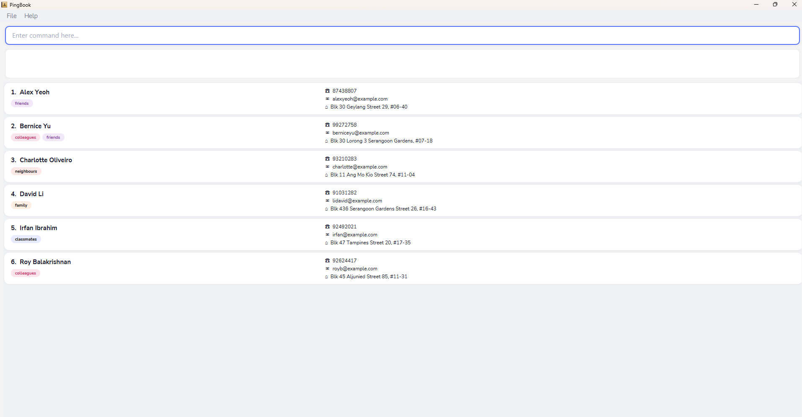

**PingBook is a desktop application for managing your contacts quickly using typed commands.** While it has a GUI, most of the user interactions happen using a CLI (Command Line Interface).

You can add, edit, search, organise, and archive contacts without ever touching the mouse. Starred contacts appear at the top of your list, archived contacts stay out of sight until you need them, and command aliases let you create shortcuts for the commands you use most.

If you can type quickly, PingBook lets you manage hundreds of contacts faster than any click-based app.

* If you are interested in using PingBook, head over to the [_Quick Start_ section of the **User Guide**](UserGuide.html#quick-start).
* If you are interested in developing PingBook, the [**Developer Guide**](DeveloperGuide.html) is a good place to start.

**Acknowledgements**

* Libraries used: [JavaFX](https://openjfx.io/), [Jackson](https://github.com/FasterXML/jackson), [JUnit5](https://github.com/junit-team/junit5)
